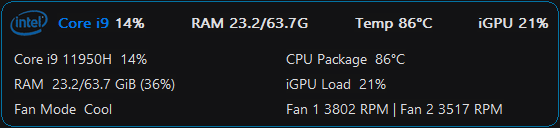
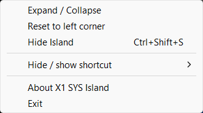
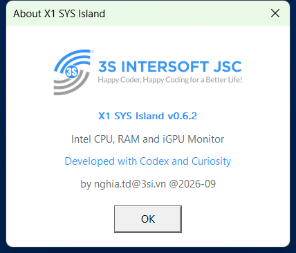

# X1 SYS Island v0.8.1

X1 SYS Island is a Windows x64 Win32/GDI overlay for Intel CPU load, system RAM, Intel iGPU load, CPU Package temperature, and read-only fan telemetry. It matches X1 AI Island's 560 px layout: 560x46 collapsed and 560x128 expanded.

## Screenshots

Screenshots of v0.7.0 running on Windows. Sensor values vary with hardware and current workload.

### Collapsed island

CPU load, RAM usage, CPU Package/TjMax, and iGPU load at a glance.

### Expanded island

Double-click to reveal CPU Package/TjMax, RAM details, and read-only fan mode and RPM.

### Context menu

Right-click to change the view, reset the position, hide the island, enable or disable hover auto-hide, choose a shortcut, or open About.

### About dialog

## Run

Keep `IntelMSR.bin` beside `X1-SYS-Island.exe`. Start the executable and approve Administrator access so PawnIO can read the CPU sensor. HWiNFO, LibreHardwareMonitor, and a web server are not required.

- `Ctrl+Shift+S`: show or hide the island (default shortcut).
- `Ctrl+Shift+D`: the alternate shortcut exposed by the context menu.
- Auto-hide on hover is enabled by default: hover for one second to hide for five seconds, then show again. Disable it from the context menu to keep the island visible.
- Left-drag to move; double-click to expand or collapse.
- Starting the executable again restores the existing hidden instance.
- Right-click for expand/collapse, reset position, hide, hover auto-hide, shortcut settings, About, and Exit.

The expanded view has three rows and two columns:

| Left | Right |
| --- | --- |
| CPU Load | CPU Package/TjMax |
| RAM used/total and percentage | iGPU Load |
| Fan Mode | Fan 1 and Fan 2 (RPM) |

## Colors

The border level is `max(CPU %, RAM %)`: below 50% is Intel blue with a 2.4-second pulse, 50-79% is yellow with a 1.4-second pulse, and 80% or higher is red with a 1.05-second pulse. Temperature, iGPU, and fan values do not affect the border level.

The collapsed CPU label follows the same load-based color logic as the RTX 3080 label in X1 AI Island. The CPU percentage itself and all numeric values remain white (`RGB(242,242,245)`). The Intel logo keeps its original colors and the About dialog follows X1 AI Island styling.

## Data sources

- **CPU load:** PDH `Processor(_Total)`.
- **RAM:** `GlobalMemoryStatusEx`; the collapsed value is GiB.
- **Intel iGPU:** DXGI identifies the adapter LUID, then PDH GPU Engine counters are aggregated per matching engine and the busiest engine is displayed.
- **CPU Package/TjMax:** MSR `0x1A2` provides the validated TjMax value and `0x1B1` provides the digital `Distance to TjMax` readout. The app calculates CPU Package as `TjMax - Distance to TjMax` and displays `C-Pkg <package>°C/<TjMax>°C` when collapsed. No HWiNFO, LibreHardwareMonitor, or web service is used.
- **Fans:** read-only `Global\\X1FanTelemetryV1` version 2 mapping produced by X1FanService. The mapping is opened and mapped with read access only; sequence, version, and data age (under five seconds) are validated. Missing or stale data displays `N/A`.

SYS does not install, start, stop, or control services or fans. Fan mode changes made by AI Island are reflected automatically. Missing data or insufficient permission is shown as `N/A`.

## Build and test

Requirements: Visual Studio 2022 C++ Build Tools and the Windows SDK. `build.bat` writes the executable to the project root and intermediate files to `build/`. To build to another path, pass it as the first argument, for example `build.bat build\\X1-SYS-Island.exe`.

Run `tests\\test.bat` for telemetry, fan mapping, and sensor conversion checks. `tests\\test.bat --require-temperature` requires an elevated Command Prompt or PowerShell. Run `tests\\test-hover.bat` for layout, border thresholds, hover timers, dragging, menu handling, and manual hide/show behavior. These tests use deterministic preview data where hardware access is not available.

## Project layout

- `x1_sys_island.cpp`: window, UI, About dialog, shortcuts, and hover behavior.
- `telemetry.h`, `cpu_temperature.h`, `fan_reader.h`: sensor and read-only fan readers.
- `assets/`: source images and embedded bitmap assets.
- `licenses/`: licenses and required module source.
- `tests/`: verification programs; not compiled into the application.
- `build/`: generated intermediates and test binaries; not part of the release package.

## Packaging

`package.ps1` builds an optimized executable and creates `dist/X1-SYS-Island-v0.8.1.zip` containing the executable, `IntelMSR.bin`, this README, third-party notices, and required licenses.

## v0.8.1 changes

- Fixes repaint flicker with a reusable off-screen back buffer and a single blit to the window.
- Limits animation repaints to the border and animated CPU label, avoiding unnecessary redraws of unchanged text and the Intel logo.
- Recreates the back buffer after size or display changes and releases it on shutdown.
- Extends deterministic hover/rendering tests to cover partial repainting and GDI resource reuse.

## v0.8.0 changes

- Caches compact text layout and reuses GDI resources during animation.
- Retains telemetry for a bounded hover-hide grace period without sampling while hidden; re-primes rate counters on return. Manual hiding and suspension release resources without the grace period.
- Avoids unchanged-policy worker wakeups and preserves sampling deadlines.
- Filters unrelated GPU counter names without allocating temporary strings.
- Fixes sensor retry deadlines, malformed-response diagnostics, and affinity-restoration checks.
- Adds deterministic sensor regression tests (`tests\\test-sensor-optimization.bat`) and worker/layout lifecycle checks.
- Keeps read-only fan mapping reopening and uncached TjMax for correctness. No measured battery-saving or speedup claim is made.

## v0.7.0 changes

- Keeps the visible island topmost after showing, resizing, dragging, and automatic re-show without background topmost polling.
- Adds a persisted, default-enabled context-menu option to disable hover auto-hide.

## v0.6.3 changes

- CPU Package remains the primary thermal value.
- Reads validated TjMax and Distance to TjMax directly from the Intel package thermal MSRs.
- Shows `C-Pkg <package>°C/<TjMax>°C` when collapsed and `CPU Package/TjMax` when expanded.

## v0.6.2 changes

- Enforces a single running instance and restores the existing window when launched again.
- Uses `Ctrl+Shift+S` as the default shortcut and stores the setting in `HotkeyV3`.
- Delays startup tasks by 30 seconds so PawnIO and the desktop are ready after logon.
- A 15-second watchdog re-signals the worker if Windows delivers an early logon visibility event.
- Reduces background work while hidden or suspended and shuts down the worker cleanly on exit.
